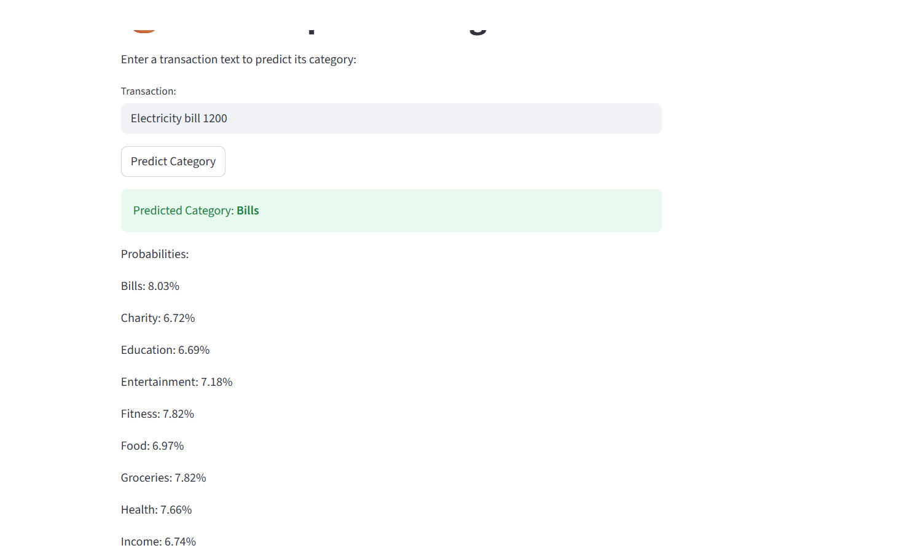

## 💰 Smart Expense Categorizer

A simple AI-powered expense categorizer that predicts the category of a transaction from its text description. Built using Python, scikit-learn, Flask, and Streamlit, this project demonstrates text classification for personal finance automation.

## Features

Classify transactions into categories like:

Food

Travel

Bills

Charity

Simple web interface via Streamlit

REST API using Flask for integration with other apps

Shows predicted probabilities for all categories

Easily extensible with more categories or a larger dataset

## Demo Screenshot



## Project Structure
smart-expense-categorizer/
├─ data/
│  └─ transactions.csv       
├─ models/
│  └─ model.joblib           # Trained model
├─ train.py                  # Script to train the model
├─ infer.py                  # Script to test predictions in terminal
├─ app.py                    # Flask API for predictions
├─ streamlit_app.py          # Streamlit frontend
├─ requirements.txt          # Python dependencies
├─ .gitignore
└─ README.md

## Installation

## 1.Clone the repository
```bash
git clone https://github.com/yourusername/smart-expense-categorizer.git
cd smart-expense-categorizer
```

## 2.Create a virtual environment
```bash
python -m venv venv
venv\Scripts\activate   # Windows
# source venv/bin/activate  # Linux / Mac
```

## 3.Install dependencies
```bash
pip install -r requirements.txt
```
## Usage

## 1.Train the model
```bash
python train.py
```

This will train a Logistic Regression model on your transaction dataset and save it in models/model.joblib.

## 2.Test predictions via terminal
```bash
python infer.py "Swiggy order 250" "Uber ride 100" "Electricity bill 1200"
```
Output includes predicted category and probabilities for each class.

## 3.Start the Flask API
```bash
python app.py
```

The API runs at: http://127.0.0.1:5000/predict

Send POST requests with JSON:

{
  "text": "Swiggy order 250"
}


Response:

{
  "preds": ["Food"],
  "probs": [[0.02, 0.01, 0.95, 0.02]],
  "classes": ["Bills", "Charity", "Food", "Travel"]
}

## 4.Launch Streamlit frontend
```bash
streamlit run streamlit_app.py
```

Enter transaction text and see predicted category with probabilities.

## Adding More Data

Edit data/transactions.csv to include more examples.

Recommended 5–20 samples per category for better accuracy.

Retrain model with python train.py.

## Dependencies

Python 3.9+

pandas

scikit-learn

joblib

Flask

Flask-CORS

Streamlit

requests

